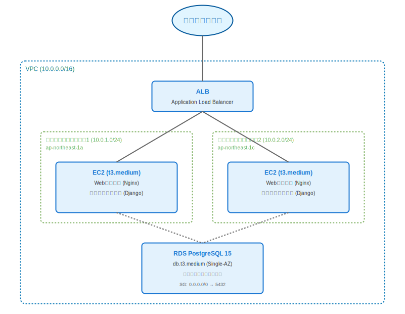
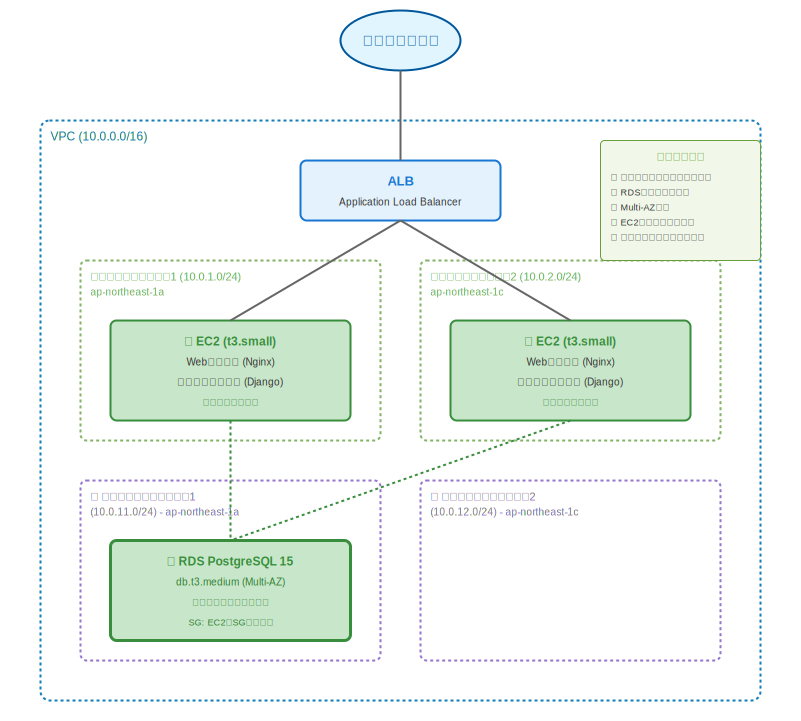

# パブリックサブネットに配置されたRDSデータベース

## 構成概要

以下は、ある中小企業が運用しているWebアプリケーションの現在の構成です。

### 現在の構成

- **VPC**: 10.0.0.0/16
- **パブリックサブネット1**: 10.0.1.0/24（ap-northeast-1a）
- **パブリックサブネット2**: 10.0.2.0/24（ap-northeast-1c）
- **ALB**: Application Load Balancer
- **EC2インスタンス**: t3.medium × 2台（Auto Scaling）
  - Webサーバー（Nginx）
  - アプリケーションサーバー（Python/Django）
- **RDS**: PostgreSQL 15（db.t3.medium、Single-AZ）
  - パブリックサブネットに配置
  - パブリックアクセス有効
- **セキュリティグループ**:
  - ALB: 0.0.0.0/0 → 80, 443
  - EC2: ALBのSGから → 8000
  - RDS: 0.0.0.0/0 → 5432

## 前提条件・制約条件

### ビジネス要件

- **サービス**: BtoB向け在庫管理SaaS
- **ユーザー数**: 企業50社、約200名のユーザー
- **稼働時間**: 平日8:00-20:00がピーク
- **重要度**: 顧客の在庫データを扱うため、データ漏洩は絶対に避けたい

### 予算制約

- **月額予算**: 8万円以内
- **現状コスト**: 約7万円/月
  - ALB: 約3,000円/月
  - EC2 t3.medium × 2: 約5万円/月
  - RDS db.t3.medium: 約1.7万円/月
- **追加予算**: 最大1万円/月まで許容可能

### 納期制約

- **改善期限**: 1ヶ月以内に実施
- **理由**: セキュリティ監査で指摘を受けた
- **段階的改善**: 可能

### 技術的制約

- **チーム構成**: エンジニア3名（バックエンド2名、フロントエンド1名）
- **スキルセット**: AWS基本サービスは理解、ネットワーク設計は経験浅い
- **既存コード**: Django ORM使用、データベース接続文字列の変更は容易
- **データベース**: PostgreSQL 15、約50GBのデータ

### 組織的制約

- **運用体制**: 平日9:00-18:00のみ対応可能
- **オンコール**: 夜間・休日対応は外部委託（月額5万円、予算外）
- **承認プロセス**: 情報システム部門の承認が必要（1週間程度）

### コンプライアンス要件

- **個人情報保護法**: 顧客企業の従業員情報を含む
- **セキュリティ基準**: 顧客企業からデータベースの外部公開禁止を要求されている

## レビュー観点

この構成を以下の観点からレビューし、問題点と改善案を提示してください。

1. **セキュリティ**: セキュリティグループ、ネットワーク構成、データ保護
2. **信頼性・可用性**: SPOF、障害対策、バックアップ戦略
3. **運用性**: 監視、ログ、デプロイ、復旧手順
4. **コスト**: リソースの適切性、コスト最適化
5. **アーキテクチャ**: 拡張性、保守性、技術的負債

---

## 詳細な回答例

### 1. セキュリティ

#### 🔴 1.1 RDSがパブリックサブネットに配置され、外部公開されている

- **問題**: RDSがパブリックサブネットに配置され、パブリックアクセスが有効
- **リスク**:
  - インターネットから直接データベースにアクセス可能
  - セキュリティグループが0.0.0.0/0を許可しており、全世界から接続可能
  - ブルートフォース攻撃のリスク
  - データ漏洩の重大なリスク
  - 顧客企業との契約違反（データベース外部公開禁止）
  - 個人情報保護法違反のリスク
- **推奨対応**:
  - **即時対応**（コスト: 無料、作業時間: 2-3時間）:
    - RDSのパブリックアクセスを無効化
    - セキュリティグループをEC2のSGからのみ許可に変更
    - **注意**: パブリックアクセス無効化だけでは不十分、プライベートサブネットへの移行が必要
  - **1週間以内**（コスト: 無料、作業時間: 1日）:
    - プライベートサブネットを作成（10.0.11.0/24、10.0.12.0/24）
    - RDSをプライベートサブネットに移行（スナップショットから復元）
    - ダウンタイム: 約30分-1時間
  - **段階的改善**:
    - Systems Manager Session Managerでデータベースメンテナンス
    - VPCエンドポイント経由でのアクセス
- **参考**:
  - [AWS Well-Architected Framework - Security Pillar](https://docs.aws.amazon.com/wellarchitected/latest/security-pillar/welcome.html)
  - [RDS Security Best Practices](https://docs.aws.amazon.com/AmazonRDS/latest/UserGuide/CHAP_BestPractices.Security.html)

#### 🔴 1.2 多層防御の原則に違反

- **問題**: データベースがアプリケーション層と同じネットワーク層に配置
- **リスク**:
  - EC2が侵害された場合、データベースへの直接アクセスが容易
  - ネットワークレベルでの防御層が不足
- **推奨対応**:
  - プライベートサブネットへの移行（上記1.1と同時実施）
  - NACLでサブネット間のトラフィック制御
  - データベース暗号化の有効化（保管時・転送時）
- **参考**: [Defense in Depth](https://docs.aws.amazon.com/wellarchitected/latest/security-pillar/defense-in-depth.html)

### 2. 信頼性・可用性

#### 🔴 2.1 RDSがSingle-AZ構成

- **問題**: RDSがSingle-AZ構成で、AZ障害時にサービス停止
- **リスク**:
  - AZ障害時にデータベースが利用不可
  - 復旧に30分-数時間かかる可能性
  - ビジネスへの影響大（在庫管理が停止）
- **推奨対応**（予算制約を考慮）:

  **オプション1: Multi-AZ化（推奨）**
  - **コスト**: +約1.7万円/月（RDSコストが約2倍）
  - **予算**: 合計8.7万円/月（予算オーバー7千円）
  - **メリット**:
    - AZ障害時の自動フェイルオーバー（1-2分）
    - 可用性99.95%
    - メンテナンス時のダウンタイム最小化
  - **デメリット**: 予算オーバー
  - **対応策**: EC2をt3.smallにダウンサイズして約2.5万円削減、予算内に収める

  **オプション2: 自動バックアップ強化（予算優先）**
  - **コスト**: +約500円/月
  - **設定**:
    - バックアップ保持期間: 7日間
    - ポイントインタイムリカバリ有効
    - 復旧手順の自動化スクリプト作成
  - **メリット**: 予算内
  - **デメリット**:
    - RTO: 30分-1時間
    - RPO: 5分
    - AZ障害時は手動復旧が必要

  **推奨**: オプション1（Multi-AZ化 + EC2ダウンサイジング）
  - セキュリティ監査の指摘対応が優先
  - 可用性向上はビジネス価値が高い
  - EC2のCPU使用率が低ければダウンサイジング可能

- **参考**: [RDS Multi-AZ Deployments](https://docs.aws.amazon.com/AmazonRDS/latest/UserGuide/Concepts.MultiAZ.html)

#### 🟡 2.2 バックアップ戦略の確認

- **問題**: 自動バックアップの設定が不明
- **リスク**: データ損失時の復旧不可
- **推奨対応**:
  - 自動バックアップ有効化（7日保持）
  - 定期的な復旧テストの実施（月1回）
  - バックアップのクロスリージョンコピー（重要度に応じて）
- **参考**: [RDS Backup and Restore](https://docs.aws.amazon.com/AmazonRDS/latest/UserGuide/CHAP_CommonTasks.BackupRestore.html)

### 3. 運用性

#### 🟡 3.1 監視・アラートの強化

- **問題**: セキュリティ関連の監視が不足している可能性
- **リスク**: 不正アクセスの検知遅延
- **推奨対応**:
  - **CloudWatch Alarms**（コスト: 約1,000円/月）:
    - RDS接続数の異常検知
    - 失敗したログイン試行の監視
    - CPU/メモリ使用率の監視
  - **VPC Flow Logs**（コスト: 約2,000円/月）:
    - ネットワークトラフィックの記録
    - 不審なアクセスパターンの検知
  - **CloudTrail**（コスト: 無料 - 基本イベント）:
    - API操作の記録
    - セキュリティグループ変更の監視
- **参考**: [Monitoring RDS](https://docs.aws.amazon.com/AmazonRDS/latest/UserGuide/CHAP_Monitoring.html)

#### 🟡 3.2 データベースアクセスの監査ログ

- **問題**: データベースレベルの監査ログが不明
- **リスク**: 不正アクセスの証跡が残らない
- **推奨対応**:
  - RDS拡張モニタリング有効化
  - PostgreSQLの監査ログ設定（pgAudit）
  - ログのS3への長期保存（7年間、コンプライアンス要件）
- **参考**: [RDS Database Log Files](https://docs.aws.amazon.com/AmazonRDS/latest/UserGuide/USER_LogAccess.html)

### 4. コスト

#### 🟡 4.1 EC2インスタンスサイズの見直し

- **問題**: t3.medium × 2台が過剰な可能性
- **リスク**: 不要なコストが発生
- **推奨対応**:
  - **即時対応**:
    - CloudWatch Metricsで実際のCPU/メモリ使用率を確認
    - 使用率が50%未満ならt3.smallにダウンサイズ
    - **削減額**: 約2.5万円/月
  - **メリット**: Multi-AZ化の予算を確保できる
  - **注意点**: ピーク時の負荷を考慮、段階的に実施
- **参考**: [EC2 Instance Types](https://aws.amazon.com/ec2/instance-types/)

#### 🟡 4.2 予約インスタンスの検討

- **問題**: オンデマンド料金で運用
- **リスク**: 長期的なコスト増
- **推奨対応**:
  - 1年予約で約30%削減
  - ただし、構成変更の可能性を考慮
  - セキュリティ改善後に検討
- **参考**: [Reserved Instances](https://aws.amazon.com/ec2/pricing/reserved-instances/)

### 5. アーキテクチャ

#### 🟡 5.1 ネットワーク設計の改善

- **問題**: プライベートサブネットが存在しない
- **リスク**: 将来的な拡張時の制約
- **推奨対応**:
  - プライベートサブネット作成（RDS移行と同時）
  - NAT Gatewayの導入（必要に応じて）
  - 3層アーキテクチャの実現（Web層、App層、DB層）
- **参考**: [VPC with Public and Private Subnets](https://docs.aws.amazon.com/vpc/latest/userguide/VPC_Scenario2.html)

---

## 改善後の推奨アーキテクチャ

### フェーズ1: 即時対応（1週間以内、予算内）

#### 構成の変更点

1. **プライベートサブネットの作成**
   - プライベートサブネット1: 10.0.11.0/24（ap-northeast-1a）
   - プライベートサブネット2: 10.0.12.0/24（ap-northeast-1c）

2. **RDSの移行**
   - プライベートサブネットに配置
   - パブリックアクセス無効化
   - セキュリティグループをEC2のSGからのみ許可

3. **EC2のダウンサイジング**
   - t3.medium → t3.small
   - CPU使用率を確認後に実施

4. **RDSのMulti-AZ化**
   - Single-AZ → Multi-AZ
   - 自動フェイルオーバー有効化

5. **セキュリティグループの改善**
   - ALB用SG: 0.0.0.0/0 → 80, 443
   - EC2用SG: ALBのSGから → 8000
   - RDS用SG: EC2のSGから → 5432（0.0.0.0/0を削除）

6. **監視の強化**
   - CloudWatch Alarms設定
   - VPC Flow Logs有効化
   - RDS拡張モニタリング

#### コスト比較

| 項目 | 現状 | フェーズ1 | 差額 |
|------|------|-----------|------|
| ALB | 3,000円 | 3,000円 | 0円 |
| EC2 t3.medium × 2 | 50,000円 | - | -50,000円 |
| EC2 t3.small × 2 | - | 25,000円 | +25,000円 |
| RDS db.t3.medium (Single-AZ) | 17,000円 | - | -17,000円 |
| RDS db.t3.medium (Multi-AZ) | - | 34,000円 | +34,000円 |
| CloudWatch Alarms | - | 1,000円 | +1,000円 |
| VPC Flow Logs | - | 2,000円 | +2,000円 |
| **合計** | **70,000円** | **65,000円** | **-5,000円** |

**予算調整**:

- 当初予算8万円に対し、6.5万円で収まる
- EC2ダウンサイジングでコスト削減しつつ、セキュリティと可用性を向上

#### 改善効果

| 指標 | 現状 | フェーズ1 | 改善 |
|------|------|-----------|------|
| データベース外部公開 | あり | なし | ✓ |
| 多層防御 | なし | あり | ✓ |
| RPO | 未定義 | 5分 | ✓ |
| RTO | 30分-数時間 | 1-2分 | ✓ |
| 可用性 | 低 | 高（99.95%） | ✓ |
| セキュリティ監査 | 不合格 | 合格 | ✓ |

### フェーズ2: 追加改善（3ヶ月後、予算+1万円）

#### 追加の改善

1. **NAT Gatewayの導入**
   - プライベートサブネットからのインターネットアクセス
   - セキュリティパッチ適用のため

2. **データベース暗号化**
   - 保管時の暗号化（KMS）
   - 転送時の暗号化（SSL/TLS）

3. **監査ログの長期保存**
   - S3への自動アーカイブ
   - 7年間保持（コンプライアンス要件）

4. **WAFの導入検討**
   - SQLインジェクション対策
   - DDoS対策

#### コスト（フェーズ2）

- 月額約7.5万円
- セキュリティレベルをさらに向上

---

## トレードオフの解説

### なぜこの選択をしたのか

#### 1. EC2ダウンサイジングを選択した理由

**優先したもの**:

- セキュリティ改善（RDSのプライベート化とMulti-AZ化）
- 予算制約（8万円以内）
- 顧客企業との契約遵守

**妥協したもの**:

- EC2のリソース余裕
- ピーク時のパフォーマンス余裕

**リスク管理**:

- CPU使用率を事前に確認
- Auto Scalingで負荷に応じてスケール
- 段階的にダウンサイズ（1台ずつ）
- ロールバック手順を準備

**将来の改善パス**:

- 負荷が増加したら、t3.mediumに戻す
- または、台数を増やす（3台構成）

#### 2. Multi-AZ化を優先した理由

**優先したもの**:

- 可用性向上（99.95%）
- ビジネス継続性（在庫管理停止の回避）
- 自動フェイルオーバー

**妥協したもの**:

- コスト（+1.7万円/月）

**リスク管理**:

- EC2ダウンサイジングでコスト相殺
- 実質的なコスト増は最小限
- ビジネス価値が高い（顧客満足度向上）

**代替案との比較**:

- Single-AZ + 強化バックアップ: コストは安いが、RTO/RPOが劣る
- Multi-AZ: コストは高いが、自動復旧で運用負荷が低い

#### 3. プライベートサブネット移行を最優先した理由

**優先したもの**:

- セキュリティ監査の指摘対応
- 顧客企業との契約遵守
- データ漏洩リスクの排除
- コンプライアンス要件

**妥協したもの**:

- 移行時のダウンタイム（30分-1時間）

**リスク管理**:

- 事前に顧客企業に通知
- 業務時間外（夜間）に実施
- ロールバック手順を準備
- 復旧テストを事前実施

**将来の改善パス**:

- NAT Gateway導入
- VPCエンドポイント活用
- より高度なネットワークセキュリティ

---

## 学習のポイント

### 1. セキュリティ最優先の判断

データベースの外部公開は、最も重大なセキュリティリスクの一つです。重要なのは：

- **即座の対応**: パブリックアクセス無効化は即座に実施
- **根本的な解決**: プライベートサブネットへの移行が必須
- **多層防御**: ネットワーク層、アプリケーション層、データ層での防御
- **コンプライアンス**: 契約違反や法令違反のリスクを認識

### 2. 予算制約下でのセキュリティ改善

予算が限られていても、セキュリティは妥協できません：

- **優先順位の明確化**: セキュリティ > コスト
- **創意工夫**: EC2ダウンサイジングでコスト捻出
- **段階的アプローチ**: 最優先事項から実施
- **ビジネス価値**: セキュリティ改善は顧客信頼につながる

### 3. 可用性とコストのバランス

Multi-AZ化はコストが約2倍になりますが：

- **ビジネスインパクト**: 在庫管理停止の損失 > Multi-AZコスト
- **運用負荷**: 自動フェイルオーバーで運用負荷削減
- **顧客満足度**: 高可用性は競争力につながる

### 4. ネットワーク設計の重要性

適切なネットワーク設計は、セキュリティの基盤です：

- **3層アーキテクチャ**: Web層、App層、DB層の分離
- **最小権限の原則**: 必要最小限のアクセスのみ許可
- **監視と監査**: VPC Flow Logs、CloudTrailでの記録

### 5. コンプライアンスとビジネス要件

技術的な最適化だけでなく、ビジネス要件も重要です：

- **契約遵守**: 顧客企業との契約を守る
- **法令遵守**: 個人情報保護法などの法令を守る
- **監査対応**: セキュリティ監査の指摘に迅速に対応

---

## 参考リソース

### AWS公式ドキュメント

- [AWS Well-Architected Framework](https://aws.amazon.com/architecture/well-architected/)
- [Security Pillar](https://docs.aws.amazon.com/wellarchitected/latest/security-pillar/welcome.html)
- [RDS Security Best Practices](https://docs.aws.amazon.com/AmazonRDS/latest/UserGuide/CHAP_BestPractices.Security.html)
- [VPC Security Best Practices](https://docs.aws.amazon.com/vpc/latest/userguide/vpc-security-best-practices.html)
- [RDS Multi-AZ](https://docs.aws.amazon.com/AmazonRDS/latest/UserGuide/Concepts.MultiAZ.html)

### セキュリティ

- [AWS Security Best Practices](https://aws.amazon.com/architecture/security-identity-compliance/)
- [Defense in Depth](https://docs.aws.amazon.com/wellarchitected/latest/security-pillar/defense-in-depth.html)
- [VPC Flow Logs](https://docs.aws.amazon.com/vpc/latest/userguide/flow-logs.html)

### コスト最適化

- [AWS Pricing Calculator](https://calculator.aws/)
- [AWS Cost Explorer](https://aws.amazon.com/aws-cost-management/aws-cost-explorer/)
- [EC2 Instance Types](https://aws.amazon.com/ec2/instance-types/)

---

## まとめ

この問題では、セキュリティ監査の指摘を受け、予算以内でデータベースのセキュリティと可用性を改善する現実的な解決策を提示しました。

**重要な教訓**:

1. セキュリティは最優先、予算制約があっても妥協しない
2. 創意工夫でコストを捻出（EC2ダウンサイジング）
3. ビジネス要件とコンプライアンスを常に意識
4. 段階的な改善で、リスクを最小化
5. 監視と監査で、継続的なセキュリティ向上

データベースの外部公開は、最も避けるべきセキュリティリスクの一つです。プライベートサブネットへの移行は、コストをかけずに実施できる重要な改善です。
