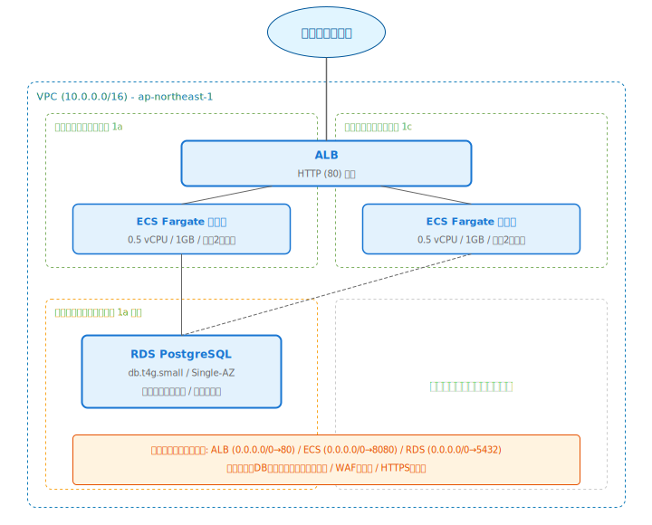
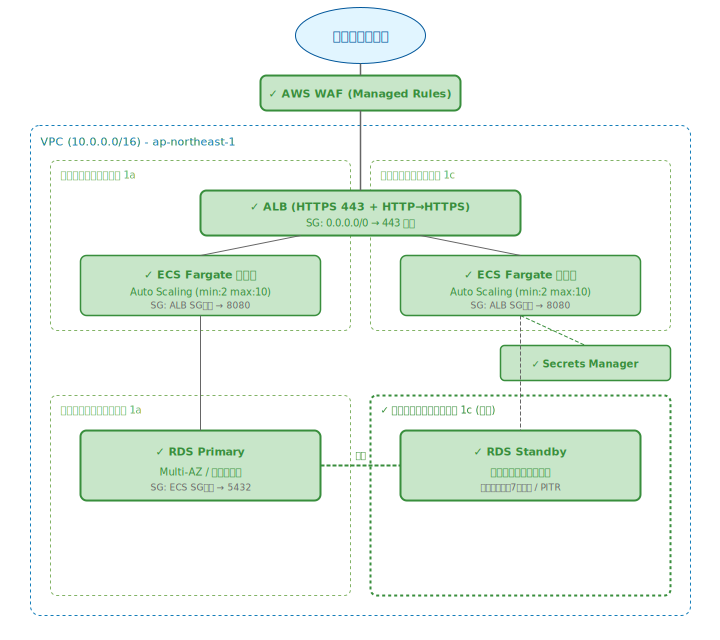

# ECS Fargate + ALB + RDS Single-AZ のECサイト構成

## 構成概要

以下は、中小企業が運用しているECサイトの現在の構成です。

### 現在の構成

- **VPC**: 10.0.0.0/16（ap-northeast-1）
- **パブリックサブネット**: 10.0.1.0/24（ap-northeast-1a）、10.0.2.0/24（ap-northeast-1c）
- **プライベートサブネット**: 10.0.10.0/24（ap-northeast-1a のみ）
- **ALB**: パブリックサブネットに配置、HTTP（80）のみ
- **ECS Fargate**: サービス1つ、タスク数固定2
  - コンテナイメージ: ECRプライベートリポジトリ
  - タスク定義: 0.5 vCPU / 1GB メモリ
  - 環境変数にDB接続情報をハードコード
- **RDS PostgreSQL**: db.t4g.small、Single-AZ（ap-northeast-1a）
  - 自動バックアップ: 無効
  - 暗号化: 無効
- **セキュリティグループ**:
  - ALB: 0.0.0.0/0 → 80
  - ECS: 0.0.0.0/0 → 8080
  - RDS: 0.0.0.0/0 → 5432

## 前提条件・制約条件

### ビジネス要件
- **サービス**: BtoC向けECサイト（アパレル）
- **月間売上**: 約800万円、繁忙期（セール時）は通常の3倍
- **ユーザー数**: 月間アクティブユーザー約3万人
- **稼働時間**: 24時間365日（深夜もアクセスあり）
- **重要度**: 注文データの損失は売上直結、1時間のダウンタイムで約30万円の機会損失

### 予算制約
- **月額予算**: 15万円以内
- **現状コスト**: 約8万円/月
  - ALB: 約3,000円/月
  - ECS Fargate（0.5 vCPU × 2タスク）: 約6,000円/月
  - RDS db.t4g.small: 約5万円/月
  - ECR / CloudWatch: 約2,000円/月
  - データ転送: 約1.5万円/月
- **追加投資**: 月額7万円まで追加可能

### 納期制約
- **改善期限**: 1ヶ月以内に主要な改善を完了
- **理由**: 来月のセールイベントまでに安定稼働が必要
- **段階的改善**: 可能だが、セール前に最低限の可用性確保が必須

### 技術的制約
- **チーム構成**: エンジニア3名（バックエンド2名、インフラ1名）
- **スキルセット**: ECS Fargateの基本運用は可能、IaCは未導入
- **アプリケーション**: Python（FastAPI）、PostgreSQL
- **決済**: 外部決済サービス（Stripe）を利用

### 組織的制約
- **運用体制**: 平日9:00-21:00は対応可能、深夜・休日はアラート通知のみ
- **オンコール**: 月2回程度の深夜対応は可能（ただし常時は不可）
- **承認プロセス**: CTO承認で実施可能

## レビュー観点

この構成を以下の観点からレビューし、問題点と改善案を提示してください。

1. **セキュリティ**: 通信の暗号化、セキュリティグループ、シークレット管理、データ保護
2. **信頼性・可用性**: SPOF、Multi-AZ、バックアップ、Auto Scaling
3. **運用性**: 監視、ログ、デプロイ戦略、障害対応
4. **コスト**: リソースの適切性、スケーリング効率
5. **アーキテクチャ**: WAF、CDN、将来の拡張性

---

## 詳細な回答例

### 1. セキュリティ

#### 🔴 1.1 ALBがHTTPのみ（HTTPS未対応）

- **問題**: ALBがHTTP（ポート80）のみでリスニングしており、HTTPS（443）が未設定
- **リスク**:
  - ユーザーの個人情報・決済情報が平文で送信される
  - 中間者攻撃（MITM）によるデータ傍受のリスク
  - ECサイトとしてPCI DSSの要件を満たせない
  - ブラウザの「保護されていない通信」警告でユーザー離脱
- **推奨対応**:
  - **即時対応**（コスト: ACM証明書は無料、ALBリスナー追加のみ）:
    - AWS Certificate Manager（ACM）でSSL/TLS証明書を発行
    - ALBにHTTPSリスナー（443）を追加
    - HTTP → HTTPSのリダイレクトルールを設定
  - **追加対応**:
    - TLS 1.2以上のセキュリティポリシーを適用
    - HSTS（HTTP Strict Transport Security）ヘッダーの設定
- **参考**: [ALB HTTPS Listeners](https://docs.aws.amazon.com/elasticloadbalancing/latest/application/create-https-listener.html)

#### 🔴 1.2 セキュリティグループが過剰に開放

- **問題**: ECSタスクとRDSのセキュリティグループが0.0.0.0/0に開放されている
- **リスク**:
  - ECSタスクへの直接アクセスが可能（ALBを経由しない攻撃）
  - RDSがインターネットから直接アクセス可能（データ漏洩の重大リスク）
  - AWS Well-Architected Frameworkのセキュリティの柱に違反
- **推奨対応**:
  - **即時対応**（コスト: 無料）:
    - ECSのSG: ALBのセキュリティグループからのみ8080を許可
    - RDSのSG: ECSのセキュリティグループからのみ5432を許可
    - 階層化されたセキュリティグループ構成に変更
- **参考**: [Security Groups for Your VPC](https://docs.aws.amazon.com/vpc/latest/userguide/vpc-security-groups.html)

#### 🔴 1.3 DB接続情報が環境変数にハードコード

- **問題**: ECSタスク定義の環境変数にデータベースの接続情報（ホスト名、ユーザー名、パスワード）が平文で記載されている
- **リスク**:
  - タスク定義を閲覧できるIAMユーザー全員がDB認証情報を取得可能
  - CloudTrailやコンソールのログに認証情報が残る可能性
  - 認証情報のローテーションが困難（タスク定義の更新が必要）
- **推奨対応**:
  - **即時対応**（コスト: Secrets Manager 約400円/月/シークレット）:
    - AWS Secrets Managerにシークレットを作成
    - ECSタスク定義で `secrets` パラメータを使用してシークレットを参照
    - タスク実行ロールにSecrets Managerへのアクセス権限を付与
  - **代替案**（コスト: 無料）:
    - Systems Manager Parameter Store（SecureString）を使用
    - Secrets Managerより機能は限定的だが、無料で利用可能
- **参考**: [ECS Secrets Management Best Practices](https://docs.aws.amazon.com/AmazonECS/latest/bestpracticesguide/security-secrets-management.html)

#### 🟡 1.4 RDSの暗号化が無効

- **問題**: RDSインスタンスのストレージ暗号化が無効
- **リスク**:
  - 保存データ（at rest）が暗号化されていない
  - コンプライアンス要件を満たせない可能性
  - スナップショットも暗号化されない
- **推奨対応**:
  - **注意**: 既存のRDSインスタンスに暗号化を直接有効化することはできない
  - **手順**: スナップショット取得 → 暗号化コピー → 暗号化スナップショットから復元
  - **タイミング**: RDS Multi-AZ化と同時に実施するのが効率的
- **参考**: [Encrypting Amazon RDS Resources](https://docs.aws.amazon.com/AmazonRDS/latest/UserGuide/Overview.Encryption.html)

### 2. 信頼性・可用性

#### 🔴 2.1 RDS Single-AZによる単一障害点

- **問題**: RDSがSingle-AZ（ap-northeast-1a のみ）で稼働しており、プライベートサブネットも1つのAZにしか存在しない
- **リスク**:
  - AZ障害時にデータベースが完全停止し、ECサイト全体がダウン
  - Single-AZのRDSはメンテナンス時にもダウンタイムが発生
  - 1時間のダウンタイムで約30万円の機会損失（セール時はその3倍）
- **推奨対応**:

  **オプション1: RDS Multi-AZ（推奨、コスト: +約5万円/月）**
  - Multi-AZに変更（同期レプリケーション）
  - 自動フェイルオーバー（60秒以内）
  - メンテナンス時のダウンタイム最小化
  - プライベートサブネットをap-northeast-1cにも追加

  **オプション2: Single-AZ + 強化バックアップ（予算優先、コスト: +約2,000円/月）**
  - 自動バックアップ有効化（保持期間7日）
  - ポイントインタイムリカバリ（PITR）で5分間隔の復旧が可能
  - RTO: 約30分、RPO: 5分
  - AZ障害時は手動復旧が必要

  **トレードオフ**:
  - Multi-AZはコストが約2倍だが、自動フェイルオーバーで運用負荷が低い
  - ECサイトで24時間稼働が必要なため、Multi-AZを強く推奨
  - 予算15万円以内に収まる（現状8万円 + Multi-AZ 5万円 = 13万円）

- **参考**: [RDS Multi-AZ Deployments](https://docs.aws.amazon.com/AmazonRDS/latest/UserGuide/Concepts.MultiAZSingleStandby.html)

#### 🔴 2.2 自動バックアップが無効

- **問題**: RDSの自動バックアップが無効になっている
- **リスク**:
  - データ損失時に復旧不可能
  - ポイントインタイムリカバリが利用できない
  - 注文データ・顧客データの完全喪失リスク
- **推奨対応**:
  - **即時対応**（コスト: バックアップストレージ分のみ、約1,000円/月）:
    - 自動バックアップを有効化（保持期間: 7日以上）
    - バックアップウィンドウを深夜帯に設定
  - **追加対応**:
    - 手動スナップショットの定期取得（月次）
    - クロスリージョンバックアップの検討（DR対策）
- **参考**: [Working with Backups](https://docs.aws.amazon.com/AmazonRDS/latest/UserGuide/USER_WorkingWithAutomatedBackups.html)

#### 🟡 2.3 ECS Fargateのタスク数が固定

- **問題**: ECSサービスのタスク数が2に固定されており、Auto Scalingが未設定
- **リスク**:
  - セール時のトラフィック増加（通常の3倍）に対応できない
  - 過負荷によるレスポンス遅延・タイムアウト
  - 逆に、深夜帯の低トラフィック時にリソースが無駄
- **推奨対応**:
  - **Target Tracking Scaling Policy**の設定:
    - CPU使用率70%をターゲットに設定
    - 最小タスク数: 2、最大タスク数: 10
    - スケールアウトのクールダウン: 60秒
    - スケールインのクールダウン: 300秒
  - **セール時の対応**:
    - Scheduled Scalingで事前にタスク数を増加
    - 最小タスク数を一時的に6に引き上げ
  - **コスト影響**: 平均的にはタスク数2-3で推移し、コスト増は約3,000円/月程度
- **参考**: [ECS Service Auto Scaling](https://docs.aws.amazon.com/AmazonECS/latest/developerguide/service-auto-scaling.html)

### 3. 運用性

#### 🟡 3.1 ALBのヘルスチェック設定が未最適化

- **問題**: ALBのヘルスチェック設定がデフォルトのまま（間隔30秒、閾値5回）
- **リスク**:
  - 異常なタスクの検知に最大150秒（30秒 × 5回）かかる
  - デプロイ時の新タスクの登録にも時間がかかる
  - 障害時のユーザー影響が長引く
- **推奨対応**:
  - ヘルスチェック間隔: 10秒
  - 正常閾値: 2回
  - 異常閾値: 3回
  - タイムアウト: 5秒
  - ヘルスチェックパス: `/health`（専用エンドポイント）
  - これにより異常検知が最大30秒に短縮
- **参考**: [Optimize Load Balancer Health Check](https://docs.aws.amazon.com/AmazonECS/latest/developerguide/load-balancer-healthcheck.html)

#### 🟡 3.2 ログ・監視の不足

- **問題**: CloudWatchの基本メトリクスのみで、アプリケーションレベルの監視が不足
- **リスク**:
  - アプリケーションエラーの検知が遅れる
  - パフォーマンス劣化の原因特定が困難
  - 障害の根本原因分析（RCA）ができない
- **推奨対応**:

  **オプション1: CloudWatch中心（予算優先、コスト: +約3,000円/月）**
  - CloudWatch Container Insightsの有効化
  - ALBアクセスログのS3出力
  - CloudWatch Alarmsの設定（CPU、メモリ、5xxエラー率）
  - SNS通知でSlack連携

  **オプション2: Datadog導入（機能優先、コスト: +約2万円/月）**
  - APM機能でリクエストトレーシング
  - ログ管理の統合
  - ダッシュボードでリアルタイム可視化
  - アラート設定の柔軟性

  **推奨**: 予算内であればCloudWatch Container Insights + ALBアクセスログから開始し、運用が安定したらDatadog等の導入を検討

- **参考**: [CloudWatch Container Insights](https://docs.aws.amazon.com/AmazonCloudWatch/latest/monitoring/ContainerInsights.html)

#### 🟡 3.3 デプロイ戦略の未定義

- **問題**: ECSのデプロイ設定がデフォルト（ローリングアップデート）のまま
- **リスク**:
  - デプロイ失敗時のロールバックが手動
  - 新旧バージョンが混在する時間が長い
  - デプロイ中のサービス品質低下
- **推奨対応**:
  - **ECSのデプロイサーキットブレーカー**を有効化:
    - デプロイ失敗時に自動ロールバック
    - `minimumHealthyPercent: 100`、`maximumPercent: 200` に設定
  - **将来的な改善**:
    - CodeDeployによるBlue/Greenデプロイメント
    - カナリアリリースの導入
- **参考**: [ECS Deployment Circuit Breaker](https://docs.aws.amazon.com/AmazonECS/latest/developerguide/deployment-circuit-breaker.html)

### 4. コスト

#### 🟡 4.1 Fargateタスクのリソース設定が不適切な可能性

- **問題**: タスク定義が0.5 vCPU / 1GB メモリで固定されているが、実際の使用率が不明
- **リスク**:
  - リソースが不足している場合、OOMKillやCPUスロットリングが発生
  - リソースが過剰な場合、不要なコストが発生
- **推奨対応**:
  - CloudWatch Container Insightsで実際のCPU/メモリ使用率を確認
  - AWS Compute Optimizerの推奨を確認
  - セール時のピーク負荷を考慮したサイジング
  - Auto Scalingと組み合わせて、タスク数で対応する方がコスト効率が良い場合もある
- **参考**: [Fargate Task Size](https://docs.aws.amazon.com/AmazonECS/latest/developerguide/task_definition_parameters.html#task_size)

#### 🟡 4.2 Fargate Spotの未活用

- **問題**: すべてのタスクがオンデマンドのFargateで稼働
- **リスク**:
  - コスト最適化の余地がある
- **推奨対応**:
  - **キャパシティプロバイダー戦略**の設定:
    - ベース: 2タスクはFARGATE（安定稼働分）
    - スケールアウト分: FARGATE_SPOTを優先（最大70%割引）
  - **注意点**:
    - Fargate Spotは中断される可能性があるため、ベースタスクには使用しない
    - ECサイトの場合、決済処理中の中断リスクを考慮
    - SIGTERMハンドリングの実装が必要
  - **コスト削減効果**: セール時のスケールアウト分で月額約2,000-5,000円の削減
- **参考**: [Fargate Spot](https://docs.aws.amazon.com/AmazonECS/latest/developerguide/fargate-capacity-providers.html)

### 5. アーキテクチャ

#### 🟡 5.1 WAFが未導入

- **問題**: ALBの前段にAWS WAFが設定されていない
- **リスク**:
  - SQLインジェクション、XSSなどのWebアプリケーション攻撃に無防備
  - DDoS攻撃への耐性が低い
  - ECサイトは攻撃対象になりやすい（決済情報、個人情報）
- **推奨対応**:
  - **AWS WAF導入**（コスト: 約1,500円/月 + リクエスト数に応じた従量課金）:
    - AWS Managed Rulesの適用（Core Rule Set、SQL Database、Known Bad Inputs）
    - レートベースルールでDDoS緩和（例: 同一IPから5分間に2,000リクエスト超で遮断）
  - **追加対応**:
    - ALBとCloudFrontの統合（2024年11月にワンクリック統合がリリース）
    - CloudFront経由のトラフィックのみALBに到達させるセキュリティグループ設定
- **参考**: [AWS WAF](https://docs.aws.amazon.com/waf/latest/developerguide/what-is-aws-waf.html)

#### 🟡 5.2 CDNの未活用

- **問題**: 静的コンテンツ（商品画像、CSS、JS）がすべてFargateタスクから配信されている
- **リスク**:
  - Fargateタスクの負荷増大
  - ユーザーへのレスポンス遅延
  - データ転送コストの増加
- **推奨対応**:
  - **CloudFront + S3**の導入:
    - 商品画像をS3に配置し、CloudFrontで配信
    - CSS/JSなどの静的アセットもS3 + CloudFront
    - ALBをオリジンとしてAPI/動的コンテンツを配信
  - **コスト効果**:
    - データ転送コストの削減（CloudFrontの方がEC2/Fargateからの転送より安い）
    - Fargateタスクの負荷軽減によりタスク数を削減可能
    - 月額約5,000円の追加で、データ転送コスト約1万円の削減が見込める
- **参考**: [CloudFront with ALB](https://docs.aws.amazon.com/AmazonCloudFront/latest/DeveloperGuide/DownloadDistS3AndCustomOrigins.html)

---

## 改善後の推奨アーキテクチャ

### フェーズ1: セール前の必須対応（2週間以内）

#### 構成の変更点

1. **HTTPS化**
   - ACMで証明書発行、ALBにHTTPSリスナー追加
   - HTTP → HTTPSリダイレクト設定

2. **セキュリティグループの階層化**
   - ALB SG: 0.0.0.0/0 → 443のみ
   - ECS SG: ALB SGからのみ → 8080
   - RDS SG: ECS SGからのみ → 5432

3. **シークレット管理の改善**
   - DB接続情報をSecrets Managerに移行
   - ECSタスク定義で `secrets` パラメータを使用

4. **RDSの可用性向上**
   - 自動バックアップ有効化（保持期間7日）
   - Multi-AZ化（自動フェイルオーバー）
   - プライベートサブネットをap-northeast-1cにも追加
   - ストレージ暗号化（スナップショット経由で移行）

5. **ECS Auto Scaling**
   - Target Tracking（CPU 70%）
   - 最小2、最大10タスク
   - デプロイサーキットブレーカー有効化

6. **AWS WAF導入**
   - AWS Managed Rules適用
   - レートベースルール設定

#### コスト比較

| 項目 | 現状 | フェーズ1 | 差額 |
|------|------|-----------|------|
| ALB | 3,000円 | 3,000円 | 0円 |
| ECS Fargate（平均2.5タスク） | 6,000円 | 7,500円 | +1,500円 |
| RDS db.t4g.small Multi-AZ | 50,000円 | 100,000円 | +50,000円 |
| Secrets Manager | - | 400円 | +400円 |
| AWS WAF | - | 1,500円 | +1,500円 |
| CloudWatch強化 | 2,000円 | 5,000円 | +3,000円 |
| データ転送 | 15,000円 | 15,000円 | 0円 |
| **合計** | **約76,000円** | **約132,400円** | **+56,400円** |

**予算15万円以内に収まる**。残り約1.8万円はフェーズ2の準備に充てる。

#### 改善効果

| 指標 | 現状 | フェーズ1 | 改善 |
|------|------|-----------|------|
| 通信暗号化 | なし | TLS 1.2+ | ✓ |
| DB自動フェイルオーバー | なし | 60秒以内 | ✓ |
| RPO | 未定義 | 5分 | ✓ |
| RTO | 数時間 | 数分 | ✓ |
| Auto Scaling | なし | CPU 70%ターゲット | ✓ |
| シークレット管理 | ハードコード | Secrets Manager | ✓ |
| WAF | なし | Managed Rules | ✓ |

### フェーズ2: セール後の改善（2-3ヶ月後）

1. **CloudFront + S3の導入**
   - 静的コンテンツの配信最適化
   - データ転送コストの削減

2. **Fargate Spotの活用**
   - キャパシティプロバイダー戦略の設定
   - スケールアウト分のコスト削減

3. **監視の強化**
   - CloudWatch Container Insights
   - X-Rayによる分散トレーシング
   - Datadog等の外部APM検討

4. **IaCの導入**
   - Terraformまたは AWS CDKで構成管理
   - 環境の再現性確保

---

## トレードオフの解説

### なぜRDS Multi-AZを最優先にしたのか

**優先したもの**:
- 24時間365日の可用性（ECサイトの生命線）
- 注文データの保護（売上直結）
- 自動フェイルオーバーによる運用負荷の軽減

**妥協したもの**:
- コスト（RDS費用が2倍）
- CloudFront/CDNの導入は後回し

**判断理由**:
- 1時間のダウンタイムで30万円の機会損失。Multi-AZの追加コスト5万円/月は、月1回のAZ障害を防ぐだけで回収できる
- Single-AZではメンテナンス時にもダウンタイムが発生し、深夜対応が常態化する
- ECサイトの信頼性はブランド価値に直結する

**将来の改善パス**:
- Aurora PostgreSQLへの移行でさらなる可用性向上（99.99%）
- Aurora Serverless v2でコスト最適化

### なぜCloudFrontよりWAFを先に導入したのか

**優先したもの**:
- ECサイトのセキュリティ（決済情報・個人情報の保護）
- SQLインジェクション等の攻撃防御

**妥協したもの**:
- パフォーマンス最適化（CDN）は後回し
- データ転送コストの削減は後回し

**判断理由**:
- ECサイトは攻撃対象になりやすく、WAFなしでの運用はリスクが高い
- WAFのManaged Rulesは低コスト（約1,500円/月）で基本的な防御が可能
- CloudFrontは性能・コスト改善であり、セキュリティほど緊急性が高くない

### なぜSecrets ManagerをParameter Storeより推奨したのか

**優先したもの**:
- 自動ローテーション機能（RDSとの統合）
- 監査ログの充実

**妥協したもの**:
- コスト（Parameter Storeは無料、Secrets Managerは約400円/月/シークレット）

**判断理由**:
- ECサイトのDB認証情報は高い機密性が求められる
- Secrets ManagerはRDSとの自動ローテーション統合がある
- 月額400円のコストはセキュリティ向上に対して十分に合理的

---

## 学習のポイント

### 1. セキュリティグループの階層化

セキュリティグループは「ソースにセキュリティグループIDを指定する」ことで、階層的なアクセス制御を実現できる。IPアドレスベースではなく、セキュリティグループベースの制御が AWS のベストプラクティス。

### 2. ECサイトにおけるHTTPSの必須性

ECサイトでHTTPのみの運用は、技術的な問題だけでなくビジネスリスク。PCI DSSの要件、ブラウザの警告表示、SEOへの影響など、多面的な理由でHTTPSは必須。ACM + ALBの組み合わせで証明書の管理コストはゼロ。

### 3. RDS Multi-AZの費用対効果

Multi-AZはコストが2倍になるが、24時間稼働のサービスでは自動フェイルオーバーの価値が非常に高い。特にECサイトでは、ダウンタイムの機会損失とMulti-AZの追加コストを比較して判断すべき。

### 4. ECS Fargateのスケーリング戦略

固定タスク数ではなく、Target Tracking + Scheduled Scalingの組み合わせが効果的。予測可能なトラフィック増加（セール等）にはScheduled Scaling、予測不能な増加にはTarget Trackingで対応する。

### 5. シークレット管理の重要性

環境変数へのハードコードは最も避けるべきアンチパターン。Secrets ManagerまたはParameter Storeを使い、タスク定義の `secrets` パラメータで注入する。これにより、認証情報の漏洩リスクを大幅に低減できる。

---

## 参考リソース

### AWS公式ドキュメント

- [AWS Well-Architected Framework](https://aws.amazon.com/architecture/well-architected/)
- [ECS Best Practices Guide](https://docs.aws.amazon.com/AmazonECS/latest/bestpracticesguide/intro.html)
- [RDS Multi-AZ Deployments](https://docs.aws.amazon.com/AmazonRDS/latest/UserGuide/Concepts.MultiAZSingleStandby.html)
- [ECS Service Auto Scaling](https://docs.aws.amazon.com/AmazonECS/latest/developerguide/service-auto-scaling.html)
- [ECS Secrets Management](https://docs.aws.amazon.com/AmazonECS/latest/bestpracticesguide/security-secrets-management.html)
- [ALB HTTPS Listeners](https://docs.aws.amazon.com/elasticloadbalancing/latest/application/create-https-listener.html)

### セキュリティ

- [AWS WAF Developer Guide](https://docs.aws.amazon.com/waf/latest/developerguide/what-is-aws-waf.html)
- [AWS Secrets Manager](https://docs.aws.amazon.com/secretsmanager/latest/userguide/intro.html)
- [VPC Security Groups](https://docs.aws.amazon.com/vpc/latest/userguide/vpc-security-groups.html)

### コスト最適化

- [Fargate Pricing](https://aws.amazon.com/fargate/pricing/)
- [Fargate Spot](https://docs.aws.amazon.com/AmazonECS/latest/developerguide/fargate-capacity-providers.html)
- [AWS Pricing Calculator](https://calculator.aws/)

### 監視・運用

- [CloudWatch Container Insights](https://docs.aws.amazon.com/AmazonCloudWatch/latest/monitoring/ContainerInsights.html)
- [ECS Deployment Circuit Breaker](https://docs.aws.amazon.com/AmazonECS/latest/developerguide/deployment-circuit-breaker.html)
- [Optimize Load Balancer Health Check](https://docs.aws.amazon.com/AmazonECS/latest/developerguide/load-balancer-healthcheck.html)
